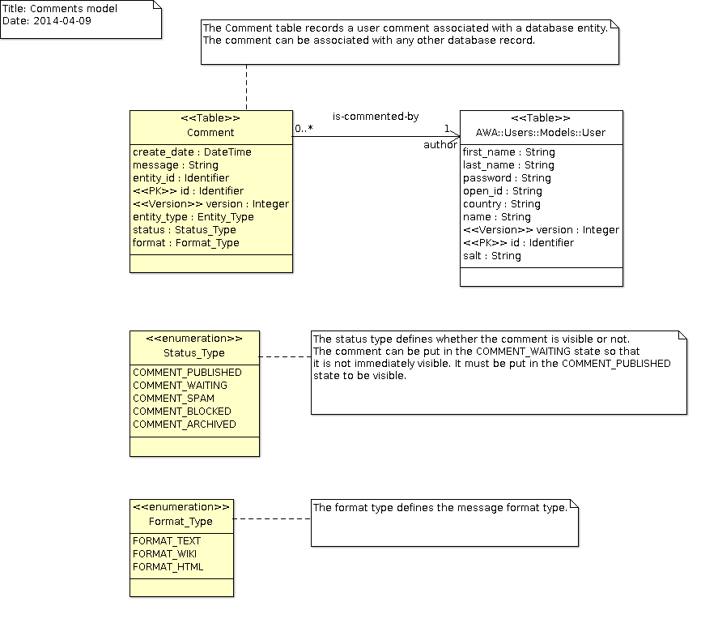

# Comments Module
The `Comments` module is a general purpose module that allows to associate user comments
to any database entity.  The module defines several bean types that allow to display a list
of comments or edit and publish a new comment.

## Integration
The <tt>Comment_Module</tt> manages the comments associated with entities.  It provides
operations that are used by the comment beans to manage the comments.
An instance of the <tt>Comment_Module</tt> must be declared and registered in the
AWA application.  The module instance can be defined as follows:

```Ada
type Application is new AWA.Applications.Application with record
   Comment_Module : aliased AWA.Comments.Modules.Comment_Module;
end record;
```

And registered in the `Initialize_Modules` procedure by using:

```Ada
Register (App    => App.Self.all'Access,
          Name   => AWA.Comments.Modules.NAME,
          URI    => "comments",
          Module => App.Comment_Module'Access);
```

## Ada Beans
Several bean types are provided to represent and manage a list of tags.
The tag module registers the bean constructors when it is initialized.
To use them, one must declare a bean definition in the application XML configuration.

### Comment_List_Bean
The `Comment_List_Bean` holds a list of comments and provides operations used by the
`awa:tagList` component to add or remove tags within a `h:form` component.
A bean can be declared and configured as follows in the XML application configuration file:

```Ada
<managed-bean>
  <managed-bean-name>postCommentList</managed-bean-name>
  <managed-bean-class>AWA.Comments.Beans.Comment_List_Bean</managed-bean-class>
  <managed-bean-scope>request</managed-bean-scope>
  <managed-property>
    <property-name>entity_type</property-name>
    <property-class>String</property-class>
    <value>awa_post</value>
  </managed-property>
  <managed-property>
    <property-name>permission</property-name>
    <property-class>String</property-class>
    <value>blog-comment-post</value>
  </managed-property>
  <managed-property>
    <property-name>sort</property-name>
    <property-class>String</property-class>
    <value>oldest</value>
  </managed-property>
  <managed-property>
    <property-name>status</property-name>
    <property-class>String</property-class>
    <value>published</value>
  </managed-property>
</managed-bean>
```

The `entity_type` property defines the name of the database table to which the comments
are assigned.  The `permission` property defines the permission name that must be used
to verify that the user has the permission do add or remove the comment.


#### AWA.Comments.Models.Comment_Info

The comment information.

| Type     | Ada      | Name       | Description                                             |
|:---------|:---------|:-----------|:--------------------------------------------------------|
||Identifier|id|the comment identifier.|
||String|author|the comment author's name.|
||String|email|the comment author's email.|
||Date|date|the comment date.|
||AWA.Comments.Models.Format_Type|format|the comment format type.|
||String|comment|the comment text.|
||AWA.Comments.Models.Status_Type|status|the comment status.|


| Name              | Description                                                           |
|:------------------|:----------------------------------------------------------------------|
|comment-list|Get the list of comments associated with given database entity|
|all-comment-list|Get the list of comments associated with given database entity|


## Data model
The database model is generic and it uses the `Entity_Type` provided by
[Ada Database Objects](https://github.com/stcarrez/ada-ado) to associate a comment to entities stored in
different tables.  The `Entity_Type` identifies the database table and the stored
identifier in `for_entity_id` defines the entity in that table.




