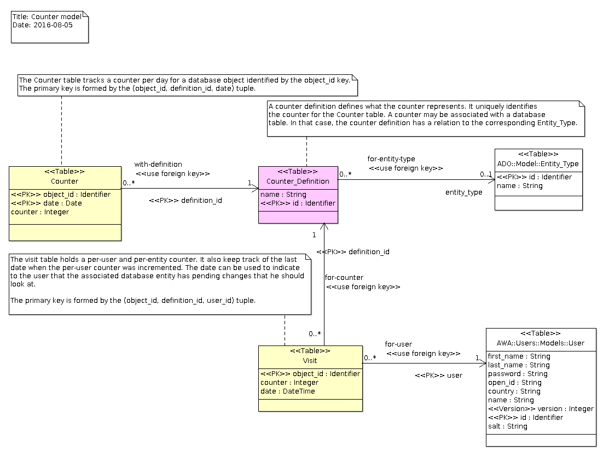

# Counters Module
The `Counters` module defines a general purpose counter service that allows to
associate counters to database entities.  For example it can be used to track the number
of times a blog post or a wiki page is accessed.  The `Counters` module maintains the
counters in a table on a per-day and per-entity basis.  It allows to update the full counter
in the target database entity table.

## Counter Module
The `Counter_Module` manages the counters associated with database entities.
To avoid having to update the database each time a counter is incremented, counters
are kept temporarily in a `Counter_Table` protected type.  The table contains
only the partial increments and not the real counter values.  Counters are flushed
when the table reaches some limit, or, when the table is oldest than some limit.
Counters are associated with a day so that it becomes possible to gather per-day counters.
The table is also flushed when a counter is incremented in a different day.

## Integration
An instance of the `Counter_Module` must be declared and registered in the
AWA application.  The module instance can be defined as follows:

```Ada
with AWA.Counters.Modules;
...
type Application is new AWA.Applications.Application with record
   Counter_Module : aliased AWA.Counters.Modules.Counter_Module;
end record;
```

And registered in the `Initialize_Modules` procedure by using:

```Ada
Register (App    => App.Self.all'Access,
          Name   => AWA.Counters.Modules.NAME,
          Module => App.Counter_Module'Access);
```


### Configuration
| Name                      | Description                                                    |
|:--------------------------|:---------------------------------------------------------------|
|counters.counter_age_limit|The maximum age limit in seconds for a pending counter increment to stay in the internal table. When a pending counter reaches this age limit, the pending counter increments are flushed and the table is cleared. The default is 5 minutes.|
| |300|
|counters.counter_limit|The maximum number of different counters which can be stored in the internal table before flushing the pending increments to the database. When this limit is reached, the pending counter increments are flushed and the table is cleared.|
| |1000|


## Counter Declaration
Each counter must be declared by instantiating the `Definition` package.
This instantiation serves as identification of the counter and it defines the database
table as well as the column in that table that will hold the total counter.  The following
definition is used for the read counter of a wiki page.  The wiki page table contains a
`read_count` column and it will be incremented each time the counter is incremented.

```Ada
 with AWA.Counters.Definition;
 ...
 package Read_Counter is
    new AWA.Counters.Definition (AWA.Wikis.Models.WIKI_PAGE_TABLE, "read_count");
```

When the database table does not contain any counter column, the column field name is not
given and the counter definition is defined as follows:

```Ada
 with AWA.Counters.Definition;
 ...
 package Login_Counter is
    new AWA.Counters.Definition (AWA.Users.Models.USER_PAGE_TABLE);
```

Sometimes a counter is not associated with any database entity.  Such counters are global
and they are assigned a unique name.

```Ada
 with AWA.Counters.Definition;
 ...
 package Start_Counter is
    new AWA.Counters.Definition (null, "startup_counter");
```

## Incrementing the counter
Incrementing the counter is done by calling the `Increment` operation.
When the counter is associated with a database entity, the entity primary key must be given.
The counter is not immediately incremented in the database so that several calls to the
`Increment` operation will not trigger a database update.

```Ada
 with AWA.Counters;
 ...
 AWA.Counters.Increment (Counter => Read_Counter.Counter, Key => Id);
```

A global counter is also incremented by using the `Increment` operation.

```Ada
 with AWA.Counters;
 ...
 AWA.Counters.Increment (Counter => Start_Counter.Counter);
```

## Ada Bean
The <b>Counter_Bean</b> allows to represent a counter associated with some database
entity and allows its control by the <awa:counter> component.


## HTML components
The counter component is an Ada Server Faces component that allows to increment
and display easily the counter.  The component works by using the `Counter_Bean`
Ada bean object which describes the counter in terms of counter definition, the
associated database entity, and the current counter value.

```Ada
<awa:counter value="#{wikiPage.counter}"/>
```

When the component is included in a page the `Counter_Bean` instance associated
with the EL `value` attribute is used to increment the counter.  This is similar
to calling the `AWA.Counters.Increment` operation from the Ada code.


## Data model
The `Counters` module has a simple database model which needs two tables.
The `Counter_Definition` table is used to keep track of the different counters
used by the application.  A row in that table is created for each counter declared by
instantiating the `Definition` package.  The `Counter` table holds the counters
for each database entity and for each day.  By looking at that table, it becomes possible
to look at the daily access or usage of the counter.




