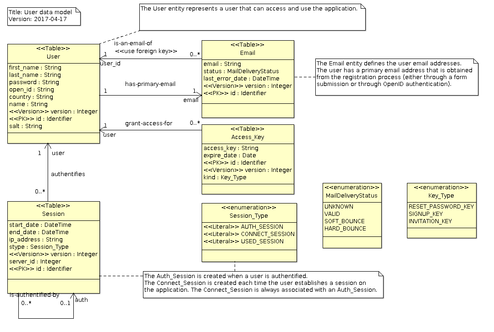

# Users Module
The `Users.Module` manages the creation, update, removal and authentication of users
in an application.  The module provides the foundations for user management in
a web application.

A user can register himself by using a subscription form.  In that case, a verification mail
is sent and the user has to follow the verification link defined in the mail to finish
the registration process.  The user will authenticate using a password.

A user can also use an OpenID account and be automatically registered.

A user can have one or several permissions that allow to protect the application data.
User permissions are managed by the `Permissions.Module`.

## Introduction

## Introduction
The *users* module provides a *users* service which controls the user data model.

## Events
The *users* module exposes a number of events which are posted when some action
are performed at the service level.

### user-register
This event is posted when a new user is registered in the application.
It can be used to send a registration email.

### user-create
This event is posted when a new user is created.  It can be used to trigger
the pre-initialization of the application for the new user.

### user-lost-password
This event is posted when a user asks for a password reset through an
anonymous form.  It is intended to be used to send the reset password email.

### user-reset-password
This event is posted when a user has successfully reset his password.
It can be used to send an email.

## Configuration
The *users* module uses a set of configuration properties to configure the OpenID
integration.

| Name           | Description                                                               |
| Name           | Description                                                               |
|:---------------|:--------------------------------------------------------------------------|
|:---------------|:--------------------------------------------------------------------------|
|login|This bean is used by the login form|
|login|This bean is used by the login form|
|register|This bean is used by the registration form|
|register|This bean is used by the registration form|
|resetPassword|This bean is used by the reset password form|
|resetPassword|This bean is used by the reset password form|
|lostPassword|This bean is used by the lost password form|
|lostPassword|This bean is used by the lost password form|
|logout|This bean is used by the logout process|
|logout|This bean is used by the logout process|
|user|This bean allows to provide information about the current logged user.|
|user|This bean allows to provide information about the current logged user.|

### Configuration
| Name                      | Description                                                    |
|:--------------------------|:---------------------------------------------------------------|
|openid.realm|The REALM URL used by OpenID providers to verify the validity of the verification callback.|
| |#{app_url_base}/auth|
|openid.callback_url|The verification callback URI used by the OpenID provider to redirect the user after authentication.|
| |#{app_url_base}/auth/verify|
|openid.success_url|The URI where the user is redirected after a successful authentication.|
| |#{contextPath}/workspaces/main.html|
|auth.url.orange|Orange OpenID access point|
| |http://openid.orange.fr|
|auth.provider.orange|Auth provider to use for Orange|
| |openid|
|auth.url.yahoo|Yahoo! OpenID access point|
| |http://open.login.yahooapis.com/openid20/www.yahoo.com/xrds|
|auth.provider.yahoo|Auth provider to use for Yahoo!|
| |openid|
|auth.url.google|Google OpenID access point|
| |https://www.google.com/accounts/o8/id|
|auth.provider.google|Auth provider to use for Google|
| |openid|
|auth.url.facebook|Facebook OAuth access point|
| |https://www.facebook.com/dialog/oauth|
|auth.provider.facebook|Auth provider to use for Facebook|
| |facebook|
|facebook.callback_url|Facebook verify callback|
| |#{app_oauth_url_base}#{contextPath}/auth/verify|
|facebook.request_url|Facebook request OAuth token access point|
| |https://graph.facebook.com/oauth/access_token|
|facebook.scope|Facebook permission scope|
| |public_profile,email|
|facebook.client_id|Facebook API client ID|
| |#{app_facebook_client_id}|
|facebook.secret|Facebook API secret|
| |#{app_facebook_secret}|
|auth.url.google-plus|Google+ OAuth access point|
| |https://accounts.google.com/o/oauth2/auth|
|auth.provider.google-plus|Auth provider to use for Google+|
| |google-plus|
|google-plus.issuer|Google+ issuer identification|
| |accounts.google.com|
|google-plus.callback_url|Google+ verify callback|
| |#{app_oauth_url_base}#{contextPath}/auth/verify|
|google-plus.request_url|Google+ request OAuth token access point|
| |https://accounts.google.com/o/oauth2/token|
|google-plus.scope|Google+ permission scope|
| |openid profile email|
|google-plus.client_id|Google+ API client ID|
| |#{app_google_plus_client_id}|
|google-plus.secret|Google+ API secret|
| |#{app_google_plus_secret}|
|auth-filter.redirect|URI to redirect to the login page|
| |#{contextPath}/auth/login.html|
|verify-filter.redirect|URI to redirect to the login page|
| |#{contextPath}/auth/login.html|

## Data model

