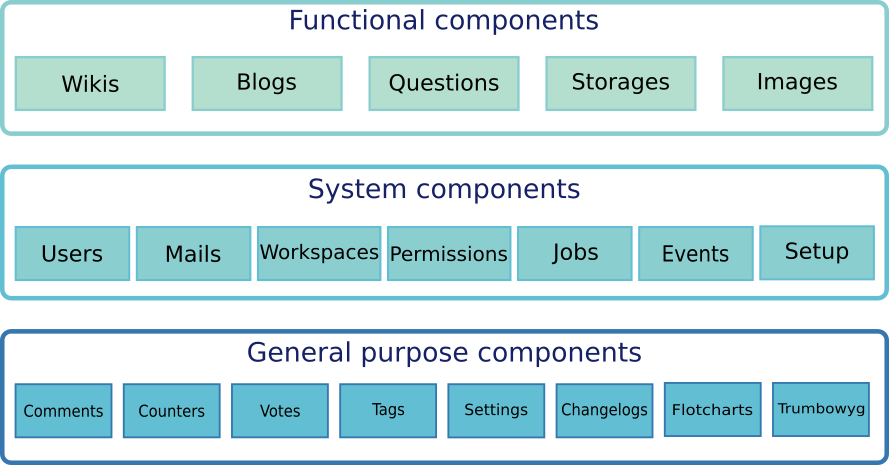

# Introduction

Ada Web Application is a framework to build a Web Application in Ada 2012.
The framework provides several ready to use and extendable modules that are common
to many web application.  This includes the login, authentication, users, permissions,
managing comments, tags, votes, documents, images.  It provides a complete blog,
question and answers and a wiki module.

AWA simplifies the Web Application development by taking care of user management with
Google+, Facebook authentication and by providing the foundations on top of which you
can construct your own application.  AWA provides a powerful permission management
that gives flexibility to applications to grant access and protect your user's resources.

A typical architecture of an AWA application is represented by the picture below:

Because your application sits on top of AWA framework, it benefits of all the functionalities
that AWA uses for its implementation:

* The Web server is built on top of the Ada Web Server library,
* The presentation layer is using Ada Server Faces which allows to use the same design pattern as the Java Server Faces,
* The database access is provided by Ada Database Objects

Apart from this architecture, the Dynamo tool is used to generate code automatically and help
starting the project quickly.

AWA is composed of several configuration components also called modules or plugins.
Components are classified in three categories:

* System components,
* General purpose components,
* Functional components.

## System Components

The **System Components** represent the core components onto which all other components are based.
These component don't provide any real functionality for a final user but they are necessary for
the Web application to operate.  These components include:

* The [Users Module](AWA_Users.md) manages the creation, update, removal and authentication of users,
* The [Mail Module](AWA_Mail.md) allows an application to format and send a mail,
* The [Jobs Module](AWA_Jobs.md) provides a batch job framework for modules to execute long running actions,
* The [Events Module] implements an eventing system to share events with other modules,
* The [Workspace Module](AWA_Workspaces.md) defines a workspace area for other plugins to connect and plug into.

## General Purpose Components

The **General Purpose Components** are components which provide generic functionalities that can
be plugged and used by functional components.

* The [Tags Module](AWA_Tags.md) allows to associate general purpose tags to any database entity,
* The [Votes Module](AWA_Votes.md) allows users to vote for objects defined in the application,
* The [Comments Module](AWA_Comments.md) is a general purpose module that allows to associate user comments to any database entity,
* The [Counters Module](AWA_Counters.md) defines a general purpose counter service allowing to associate counters to database entities,
* The [Changelogs Module](AWA_Changelogs.md) associates logs produced by users to any database entity.

## Functional Components

The **Functional Components** implement a final functionality for a user.  They are using the
system components such as [User Model](AWA_Users.md) for the user management but also general purpose components
such as [[AWA_Tags]] or [[AWA_Counters]].

* The [Questions Module](AWA_Questions.md) is a simple question and answer system,
* The [Blogs Module](AWA_Blogs.md) is a small blog application which allows users to publish articles,
* The [Wikis Module](AWA_Wikis.md) provides a complete Wiki system allowing users to create their own Wiki environment.

To in the installation process of final applications, the [Setup Application] is a special
component that you can decide to customize to provide an installation and configuration process
to your own application.

